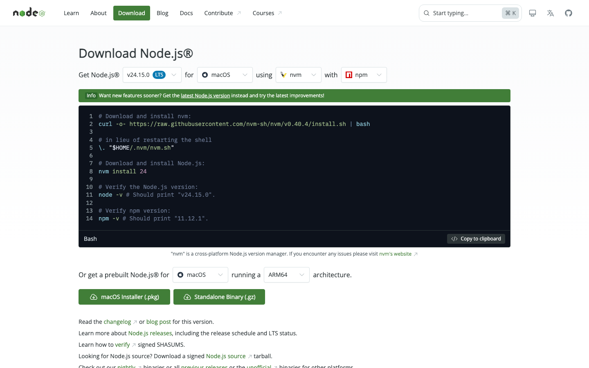
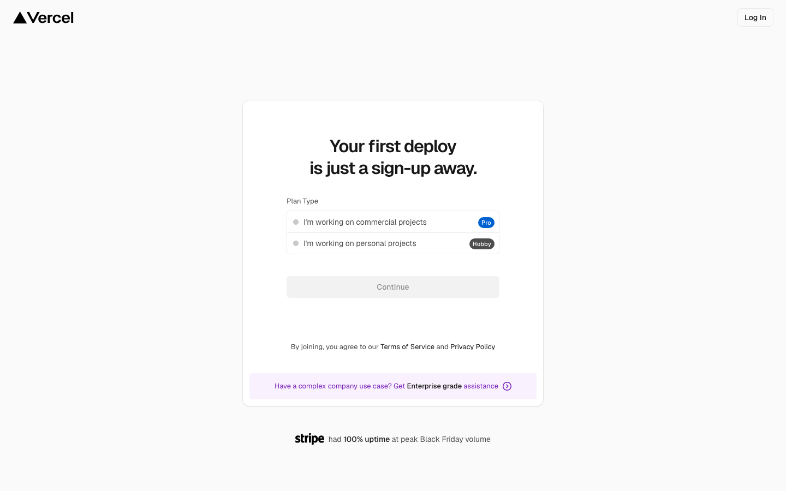

# Pre-Class Setup — macOS

Step-by-step setup for Mac users. Follow each step in order. Time required: ~25 minutes.

> **About the screenshots:** Some sections show a callout block like `📸 SCREENSHOT` — those are spots where the instructor will drop a visual reference. The text instructions stand on their own.

---

## Step 1 / Install Claude Code

### 1.1 — Open the Terminal app

Press `Cmd + Space` to open Spotlight Search. Type **Terminal**. Press `Enter`.

> 📸 **SCREENSHOT** → `images/mac/01-spotlight-terminal.png`
> *Spotlight search bar showing "Terminal" with the Terminal.app result highlighted.*

A small dark window opens with a blinking cursor. This is the macOS terminal — your command-line.

### 1.2 — Check if you have Node.js

Paste this and press `Enter`:

```bash
node --version
```

- **If you see a version number** (e.g. `v20.11.0`) — skip to **Step 1.4**.
- **If you see `command not found`** — go to **Step 1.3**.

### 1.3 — Install Node.js (only if Step 1.2 said "command not found")

Open <https://nodejs.org/en/download> in your browser. Click the green **macOS Installer (.pkg)** button.



Run the downloaded `.pkg` file. Click through the installer (Continue → Continue → Install → enter your password).

**Important:** Close your terminal completely (`Cmd + Q`) and open a new one before continuing.

### 1.4 — Install Claude Code

Paste this and press `Enter`:

```bash
npm install -g @anthropic-ai/claude-code
```

Wait ~30 seconds. You'll see lines scroll by, then a message like:

```
added 47 packages in 32s
```

> 📸 **SCREENSHOT** → `images/mac/03-claude-install-success.png`
> *Terminal showing the install completed with the "added X packages" line.*

If you see `EACCES` permission errors, run instead:

```bash
sudo npm install -g @anthropic-ai/claude-code
```

Enter your Mac password when prompted.

### 1.5 — Verify Claude Code installed

```bash
claude --version
```

You should see a version number (e.g. `2.0.5`).

> 📸 **SCREENSHOT** → `images/mac/04-claude-version.png`
> *Terminal showing the version number output.*

### 1.6 — Log in to Anthropic

Type:

```bash
claude
```

Your default browser opens automatically with an Anthropic login page. Sign in (or create an account if you don't have one).

After authorizing, the browser shows "You can return to Claude Code now." Switch back to your terminal — Claude Code's prompt is waiting for input.

> 📸 **SCREENSHOT** → `images/mac/06-claude-prompt.png`
> *Terminal showing the Claude Code interface with the prompt waiting.*

✅ **Step 1 complete.** Type `exit` or press `Ctrl + C` twice to quit Claude Code.

---

## Step 2 / Install both workshop skills

We'll install two skills with one paste:

- **Seedance Loop Prompt Builder** — turns video ideas into cinema-grade Seedance prompts
- **Frontend Design** — Anthropic's official UI-building skill

### 2.1 — In a fresh terminal (not inside Claude Code)

Make sure Claude Code is closed. Open a regular terminal.

### 2.2 — Paste this entire block and press `Enter`

```bash
mkdir -p ~/.claude/skills/seedance-loop-prompt ~/.claude/skills/frontend-design && \
curl -L -o ~/.claude/skills/seedance-loop-prompt/SKILL.md https://raw.githubusercontent.com/danielpaulai/website-design/main/.claude/seedance-loop-prompt/SKILL.md && \
curl -L -o ~/.claude/skills/frontend-design/SKILL.md https://raw.githubusercontent.com/danielpaulai/website-design/main/.claude/frontend-design/SKILL.md
```

Two download progress indicators flash by. When both complete, you're back at the prompt.

> 📸 **SCREENSHOT** → `images/mac/07-skills-installed.png`
> *Terminal showing the two `curl` downloads completing.*

### 2.3 — Verify both skills loaded

Open Claude Code:

```bash
claude
```

In the Claude prompt, type:

```
List your installed skills.
```

Press `Enter`. Claude responds with a list. **Both** `seedance-loop-prompt` and `frontend-design` should appear.

> 📸 **SCREENSHOT** → `images/mac/08-skills-listed.png`
> *Claude Code response showing both skill names.*

✅ **Step 2 complete.**

---

## Step 3 / Create a KIE.AI account + top up $5

### 3.1 — Sign up

Open <https://kie.ai>. Click **Get Started** (top right).


On the signup page, use email or "Continue with Google" — both work.

### 3.2 — Top up $5

Once logged in, find **Billing** or **Credits** in the dashboard sidebar. Click **Top Up** and add **$5 USD**.

> 📸 **SCREENSHOT** → `images/mac/10-kie-billing.png`
> *KIE.AI billing dashboard showing the $5 top-up confirmed.*

A 10-second 1080p Seedance render costs a small fraction of $1 — $5 covers many test renders.

✅ **Step 3 complete** when the dashboard shows ≥ $5 of credit.

---

## Step 4 / Create a GitHub account

We'll use GitHub during the session to store your project. **Just sign up — don't create a repository yet.**

Open <https://github.com/signup>. Fill out the form.


Use your real email and pick a username you're happy with — it appears in your project URLs forever. Verify your email when GitHub sends the link.

✅ **Step 4 complete** when you can log in and see your GitHub dashboard.

---

## Step 5 / Create a Vercel account

Open <https://vercel.com/signup>. On the plan-type screen, pick **I'm working on personal projects (Hobby)** and click **Continue**.



On the next step, choose **Continue with GitHub** to link both accounts now (saves a step in the session). Authorize Vercel when prompted. You'll land on the Vercel dashboard.

✅ **Step 5 complete** when you can see your Vercel dashboard.

---

## Optional warmup task — generate one Seedance prompt (5 min)

This is optional but **highly recommended.** Attendees who do the warmup save 30+ minutes during the session.

Open Claude Code:

```bash
claude
```

Paste this prompt and press `Enter`:

> I want to use the seedance-loop-prompt skill. Generate a Seedance 2 prompt for a 6-second seamless looping background video of a hand-poured espresso into a porcelain cup. The cafe is called "Quarter Turn".

Read the output. Notice how a vague brief becomes a cinema-grade prompt with named cinematographers, specific lens millimeters, film stocks, BRDF material descriptors, and explicit loop mechanics.

**Bonus:** paste the primary prompt into your KIE.AI dashboard and render the video. Costs ~$0.30 of your $5 credit. Seeing the end-to-end flow once before class makes the live session click immediately.

---

## Before you arrive — think about ONE thing

Spend 10 minutes imagining the project you'd like to build during the session:

- A **subject** — a product, brand, fictional firm, anything
- A **6–10 second looping video** that shows it cinematically
- A **single-page website** built around that loop

Don't write anything down. Just have the vision in your head. The skill turns vision into prompt; the prompt turns into video; the video becomes the hero of a website you'll deploy live before the session ends.

---

## Verify everything

Tick all of these before the session starts:

- [ ] `claude --version` prints a version number
- [ ] `claude` opens Claude Code and you can type to it
- [ ] `seedance-loop-prompt` and `frontend-design` both appear in skill list
- [ ] KIE.AI dashboard shows ≥ $5 credit
- [ ] GitHub dashboard accessible
- [ ] Vercel dashboard accessible
- [ ] (Optional) You generated one Seedance prompt with the skill

When the boxes are checked — you're ready.

---

## Troubleshooting

### `npm: command not found`

Node.js isn't installed. Get the **LTS** version from <https://nodejs.org>, run the `.pkg` installer, then close and reopen your terminal.

### `claude: command not found` (after install)

Close the terminal completely (`Cmd + Q`) and open a new one. If still failing:

```bash
echo 'export PATH="$PATH:$(npm prefix -g)/bin"' >> ~/.zshrc && source ~/.zshrc
```

Then retry `claude --version`.

### Skills don't appear after Step 2

You didn't fully restart Claude Code. Type `exit`, close the terminal entirely, open a new one, and run `claude` again.

### KIE.AI top-up fails

Try a different payment method. If still failing, message the instructor — we have a backup video service for the session (Higgsfield, Runway, or Kling).

### GitHub asks for SMS / phone verification

Use your real number. GitHub uses it for security only.

### Vercel "Continue with GitHub" doesn't work

Sign up with email instead. We'll link the GitHub account in the session — takes 30 seconds.

### Still stuck

Message the instructor before the session starts. Don't show up unable to install — we'll lose group time.

---

## What you'll do in the session

1. You describe a subject and website concept to Claude Code
2. The Seedance skill writes a cinema-grade video prompt
3. You paste it into KIE.AI to render the video
4. The Frontend Design skill builds the website around it
5. Push to GitHub, deploy to Vercel
6. You leave with a live URL

See you tomorrow.
