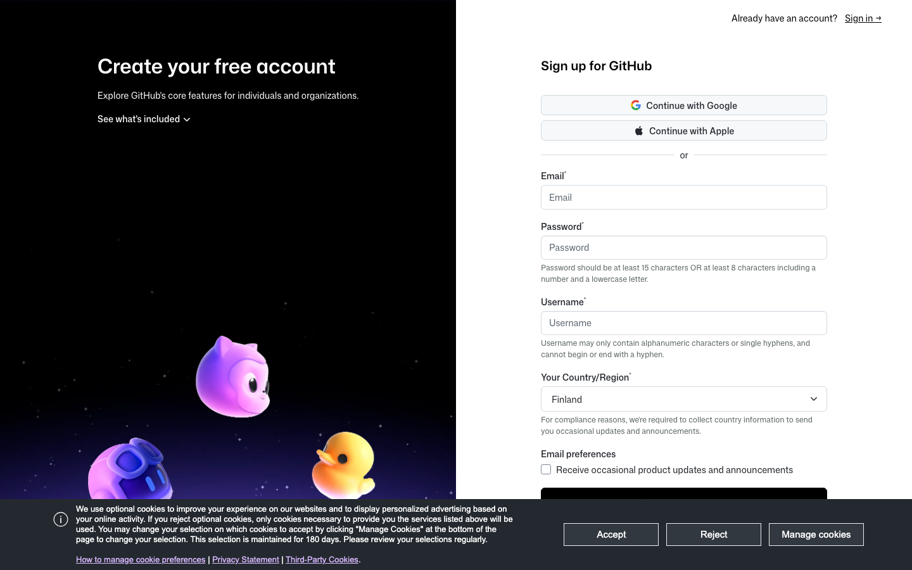

# Pre-Class Setup — Windows

Step-by-step setup for Windows users. Follow each step in order. Time required: ~25 minutes.

> **About the screenshots:** Some sections show a callout block like `📸 SCREENSHOT` — those are spots where the instructor will drop a visual reference. The text instructions stand on their own.

---

## Step 1 / Install Claude Code

### 1.1 — Open PowerShell

Press the `Windows` key. Type **PowerShell**. **Right-click** on **Windows PowerShell** in the results, then choose **Run as administrator**.

> 📸 **SCREENSHOT** → `images/windows/01-powershell-start.png`
> *Start menu showing PowerShell with the right-click "Run as administrator" option.*

A blue (or dark) window opens with `PS C:\Users\YourName>` waiting for input.

> **Why administrator?** Some `npm install -g` commands need elevated permissions on Windows. Save yourself a debug loop.

### 1.2 — Check if you have Node.js

Paste this and press `Enter`:

```powershell
node --version
```

- **If you see a version number** (e.g. `v20.11.0`) — skip to **Step 1.4**.
- **If you see `not recognized as the name of a cmdlet`** — go to **Step 1.3**.

### 1.3 — Install Node.js (only if Step 1.2 failed)

Open <https://nodejs.org/en/download> in your browser. Switch the **for** dropdown to **Windows**, then click the green **Windows Installer (.msi)** button.


Run the downloaded `.msi` installer. Click through (Next → I accept → Next → Install). Make sure the **"Automatically install necessary tools"** option is checked if it appears.

**Important:** Close PowerShell completely and open a new one (still as administrator) before continuing.

### 1.4 — Install Claude Code

Paste this and press `Enter`:

```powershell
npm install -g @anthropic-ai/claude-code
```

Wait ~30 seconds. You'll see lines scroll by, then:

```
added 47 packages in 32s
```

> 📸 **SCREENSHOT** → `images/windows/03-claude-install-success.png`
> *PowerShell showing the install completed with the "added X packages" line.*

If you see a "running scripts is disabled" error, run this once and try again:

```powershell
Set-ExecutionPolicy -Scope CurrentUser -ExecutionPolicy RemoteSigned
```

Type `Y` when prompted.

### 1.5 — Verify Claude Code installed

```powershell
claude --version
```

You should see a version number print (e.g. `2.0.5`).

> 📸 **SCREENSHOT** → `images/windows/04-claude-version.png`

### 1.6 — Log in to Anthropic

Type:

```powershell
claude
```

Your default browser opens automatically with an Anthropic login page. Sign in (or create an account if you don't have one).

After authorizing, the browser shows "You can return to Claude Code now." Switch back to PowerShell — Claude Code's prompt is waiting for input.

> 📸 **SCREENSHOT** → `images/windows/06-claude-prompt.png`
> *PowerShell showing the Claude Code interface with the prompt waiting.*

✅ **Step 1 complete.** Type `exit` or press `Ctrl + C` twice to quit Claude Code.

---

## Step 2 / Install both workshop skills

We'll install two skills with one paste:

- **Seedance Loop Prompt Builder** — turns video ideas into cinema-grade Seedance prompts
- **Frontend Design** — Anthropic's official UI-building skill

### 2.1 — In a fresh PowerShell window (not inside Claude Code)

Make sure Claude Code is closed. Open a regular PowerShell window (you don't need administrator for this step).

### 2.2 — Paste this entire block and press `Enter`

The block has 4 lines. Make sure each line ends with a backtick `` ` `` (PowerShell's line continuation character). If your terminal doesn't accept the multi-line paste, paste each command one at a time.

```powershell
New-Item -ItemType Directory -Force -Path "$HOME\.claude\skills\seedance-loop-prompt"; `
New-Item -ItemType Directory -Force -Path "$HOME\.claude\skills\frontend-design"; `
Invoke-WebRequest -Uri "https://raw.githubusercontent.com/danielpaulai/website-design/main/.claude/skills/seedance-loop-prompt/SKILL.md" -OutFile "$HOME\.claude\skills\seedance-loop-prompt\SKILL.md"; `
Invoke-WebRequest -Uri "https://raw.githubusercontent.com/danielpaulai/website-design/main/.claude/frontend-design/SKILL.md" -OutFile "$HOME\.claude\skills\frontend-design\SKILL.md"
```

> ⚠️ **Note:** If you got a `404 Not Found` error on the first URL, the path is `seedance-loop-prompt` not `skills/seedance-loop-prompt`. Use the corrected one-liner below:

```powershell
New-Item -ItemType Directory -Force -Path "$HOME\.claude\skills\seedance-loop-prompt"; `
New-Item -ItemType Directory -Force -Path "$HOME\.claude\skills\frontend-design"; `
Invoke-WebRequest -Uri "https://raw.githubusercontent.com/danielpaulai/website-design/main/.claude/seedance-loop-prompt/SKILL.md" -OutFile "$HOME\.claude\skills\seedance-loop-prompt\SKILL.md"; `
Invoke-WebRequest -Uri "https://raw.githubusercontent.com/danielpaulai/website-design/main/.claude/frontend-design/SKILL.md" -OutFile "$HOME\.claude\skills\frontend-design\SKILL.md"
```

> 📸 **SCREENSHOT** → `images/windows/07-skills-installed.png`
> *PowerShell showing both `Invoke-WebRequest` downloads completing without errors.*

### 2.3 — Verify both skills loaded

Open Claude Code:

```powershell
claude
```

In the Claude prompt, type:

```
List your installed skills.
```

Press `Enter`. Claude responds with a list. **Both** `seedance-loop-prompt` and `frontend-design` should appear.

> 📸 **SCREENSHOT** → `images/windows/08-skills-listed.png`
> *Claude Code response listing both skill names.*

✅ **Step 2 complete.**

---

## Step 3 / Create a KIE.AI account + top up $5

### 3.1 — Sign up

Open <https://kie.ai>. Click **Get Started** (top right).


On the signup page, use email or "Continue with Google" — both work.

### 3.2 — Top up $5

Once logged in, find **Billing** or **Credits** in the dashboard sidebar. Click **Top Up** and add **$5 USD**.

> 📸 **SCREENSHOT** → `images/windows/10-kie-billing.png`
> *KIE.AI billing dashboard showing $5 confirmed.*

A 10-second 1080p Seedance render costs a small fraction of $1 — $5 covers many test renders.

✅ **Step 3 complete** when the dashboard shows ≥ $5 of credit.

---

## Step 4 / Create a GitHub account

We'll use GitHub during the session to store your project. **Just sign up — don't create a repository yet.**

Open <https://github.com/signup>. Fill out the form.



Use your real email and pick a username you're happy with — it appears in your project URLs forever. Verify your email when GitHub sends the link.

✅ **Step 4 complete** when you can log in and see your GitHub dashboard.

---

## Step 5 / Create a Vercel account

Open <https://vercel.com/signup>. On the plan-type screen, pick **I'm working on personal projects (Hobby)** and click **Continue**.


On the next step, choose **Continue with GitHub** to link both accounts now (saves a step in the session). Authorize Vercel when prompted. You'll land on the Vercel dashboard.

✅ **Step 5 complete** when you can see your Vercel dashboard.

---

## Optional warmup task — generate one Seedance prompt (5 min)

This is optional but **highly recommended.** Attendees who do the warmup save 30+ minutes during the session.

Open Claude Code:

```powershell
claude
```

Paste this prompt and press `Enter`:

> I want to use the seedance-loop-prompt skill. Generate a Seedance 2 prompt for a 6-second seamless looping background video of a hand-poured espresso into a porcelain cup. The cafe is called "Quarter Turn".

Read the output. Notice how a vague brief becomes a cinema-grade prompt with named cinematographers, specific lens millimeters, film stocks, BRDF material descriptors, and explicit loop mechanics.

**Bonus:** paste the primary prompt into your KIE.AI dashboard and render the video. Costs ~$0.30 of your $5 credit. Seeing the end-to-end flow once before class makes the live session click immediately.

---

## Before you arrive — think about ONE thing

Spend 10 minutes imagining the project you'd like to build during the session:

- A **subject** — a product, brand, fictional firm, anything
- A **6–10 second looping video** that shows it cinematically
- A **single-page website** built around that loop

Don't write anything down. Just have the vision in your head. The skill turns vision into prompt; the prompt turns into video; the video becomes the hero of a website you'll deploy live before the session ends.

---

## Verify everything

Tick all of these before the session starts:

- [ ] `claude --version` prints a version number
- [ ] `claude` opens Claude Code and you can type to it
- [ ] `seedance-loop-prompt` and `frontend-design` both appear in skill list
- [ ] KIE.AI dashboard shows ≥ $5 credit
- [ ] GitHub dashboard accessible
- [ ] Vercel dashboard accessible
- [ ] (Optional) You generated one Seedance prompt with the skill

When the boxes are checked — you're ready.

---

## Troubleshooting

### `node` or `npm` is not recognized

Node.js isn't installed (or not yet in PATH). Get the **LTS** `.msi` from <https://nodejs.org>, install it, then close PowerShell completely and open a new one.

### "Running scripts is disabled on this system"

PowerShell blocks scripts by default. Run this once:

```powershell
Set-ExecutionPolicy -Scope CurrentUser -ExecutionPolicy RemoteSigned
```

Type `Y` when prompted. Then retry your previous command.

### `claude` is not recognized after install

Close PowerShell entirely and open a new window. The new install needs a fresh shell to find the binary in PATH.

If still failing, the npm global folder may not be in PATH. Run:

```powershell
$env:Path += ";$(npm config get prefix)"
```

Then retry `claude --version`.

### Skills don't appear after Step 2

You didn't fully restart Claude Code. Type `exit`, close PowerShell entirely, open a new window, and run `claude` again.

### Multi-line paste doesn't work in PowerShell

Paste each line one at a time, removing the trailing backtick `` ` ``. Press `Enter` after each line.

### KIE.AI top-up fails

Try a different payment method. If still failing, message the instructor — we have a backup video service (Higgsfield, Runway, or Kling).

### GitHub asks for SMS / phone verification

Use your real number. GitHub uses it for security only.

### Vercel "Continue with GitHub" doesn't work

Sign up with email instead. We'll link the accounts in the session.

### Still stuck

Message the instructor before the session starts. Don't show up unable to install — we'll lose group time.

---

## What you'll do in the session

1. You describe a subject and website concept to Claude Code
2. The Seedance skill writes a cinema-grade video prompt
3. You paste it into KIE.AI to render the video
4. The Frontend Design skill builds the website around it
5. Push to GitHub, deploy to Vercel
6. You leave with a live URL

See you tomorrow.
